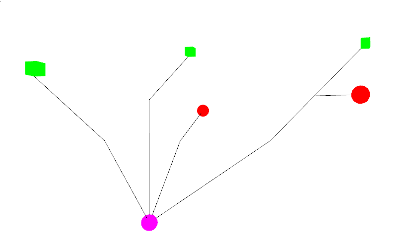
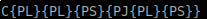
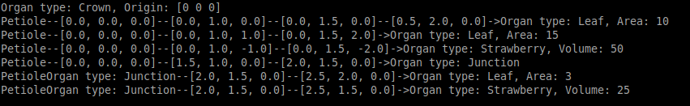

# PLANT GRAPH


Easy to use and extend graph/tree structure for strawberry plants. 

## Components
The structure is based on two main components:
- Organs/Nodes (Leaves,Strawberries,Crown etc..). Junctions are a special case of node, with only purpose to connect diverging edges.
- Edges (Petioles, runners, branches etc..)

The components classes can be found in Organs.py and easy to extend to have any attribute needed (strawberries have volumes and spherical harmonics components, leaves have areas and PCA coefficients etc..), as well as specific functions (eg. spherical harmonics coefficients to mesh for strawberries).

## Graph

The graph structure is defined in Plant_graph.py with an example of plant generated for it.
- To create a plant there is just need for a list of nodes and edges. 
- Nodes and edges have point clouds attribute to display the original point cloud. 
- Nodes have coordinates in 3D space (origin)
- Edges have a list of vertices to connect as well as a list of two node indices for start and end. In case these indices are equal to None, the plant graph will look for the closest nodes to the first and last vertices to initialize these nodes indices.

Here a simple example of a plant generated with dummy values:
```python 

    dummy_points_cloud = np.array([[0.0,0.0,0.0],[0.0,2.0,0.0],[0.0,1.0,0.0]])
    ## nodes can be crown, leaves, fruits. each with different attributes
    nodes = [Crown(dummy_points_cloud,np.array([0,0,0])),
             Leaf(dummy_points_cloud,10,np.array([0.5,2.0,0.0])),
             Leaf(dummy_points_cloud,15,np.array([0.0,1.5,2.0])),
             Strawberry(dummy_points_cloud,50,np.array([0.0,1.5,-2.0])),
             Junction(dummy_points_cloud,np.array([2.0,1.5,0.0])),
             Leaf(dummy_points_cloud,3,np.array([2.5,2.0,0.0])),
             Strawberry(dummy_points_cloud,25,np.array([2.5,1.5,0.0]))]

    ##edges can be petioles, runners, branches etc.. each class as different attributes
    # We pass to the Petiole class the pointcloud of the edge, the coordinates of all the keypoints from begining to end, and the nodes it is connected to (can be None)
    edges = [Petioles(dummy_points_cloud,[[0.0,0.0,0.0],[0.0,1.0,0.0],[0.0,1.5,0.0],[0.5,2.0,0.0]],[0,1]),
             Petioles(dummy_points_cloud,[[0.0,0.0,0.0],[0.0,1.0,1.0],[0.0,1.5,2.0]],[0,2]),
             Petioles(dummy_points_cloud,[[0.0,0.0,0.0],[0.0,1.0,-1.0],[0.0,1.5,-2.0]],[0,3]),
             Petioles(dummy_points_cloud,[[0.0,0.0,0.0],[1.5,1.0,0.0],[2.0,1.5,0.0]],[0,4]),
             Petioles(dummy_points_cloud,[[2.0,1.5,0.0],[2.5,2.0,0.0]],[4,5]),
             Petioles(dummy_points_cloud,[[2.0,1.5,0.0],[2.5,1.5,0.0]],[4,None])
            ]

    plant = Plant(nodes,edges)
```
## Useful functions on the graph plant

Once created it is possible to execute various functions on the plant graph.

### Display graph

  There are three ways of displaying the plant graph:
  - Open3D simplified mesh : Each organs and edges have a function returning a simplified open3d symbol to display the structure of the plant. To call the function simply use ```plant.Visualize()``` to get:

    
  
  - L-system string : You can also output a L-system like string describing the plant structure. To call the function simply use  ```plant.L_representation()``` to get :
  
    


  
  - String print : it is also possible to print the plant graph in the console using ```print(plant)``` to get:
    
    


